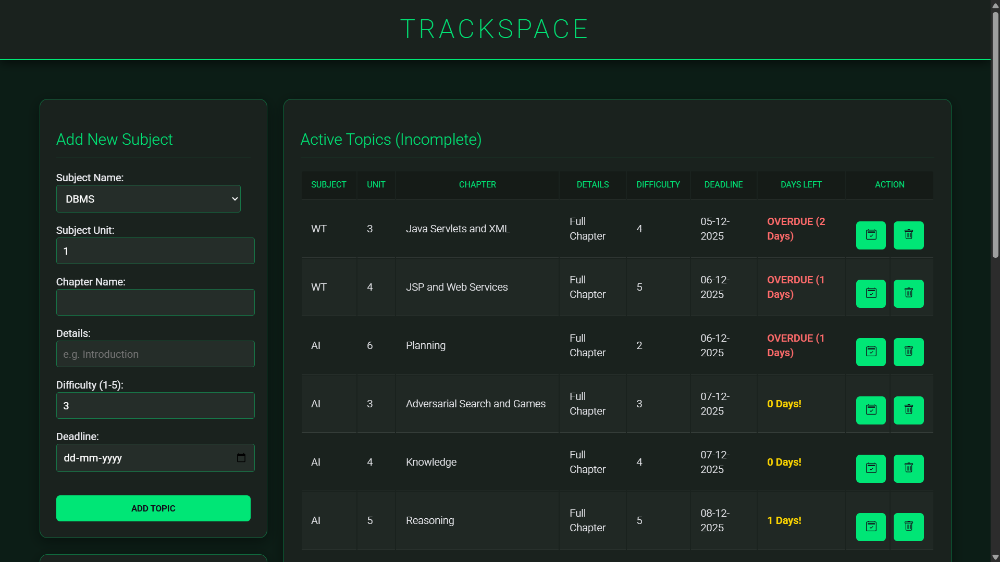
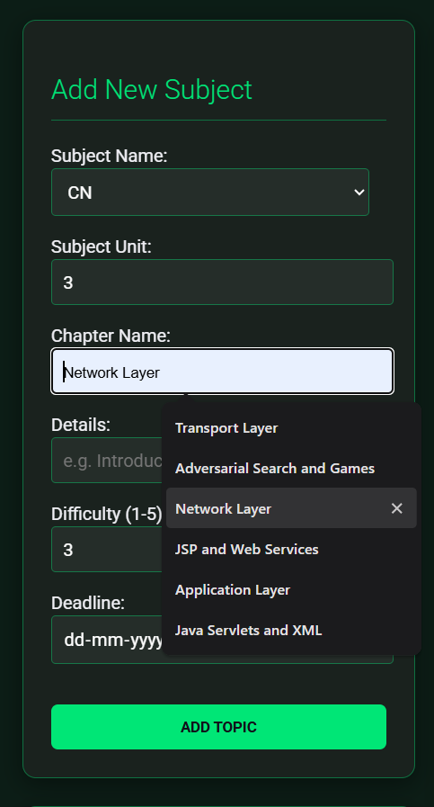
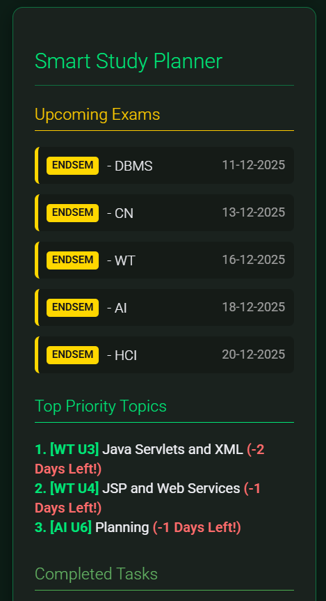
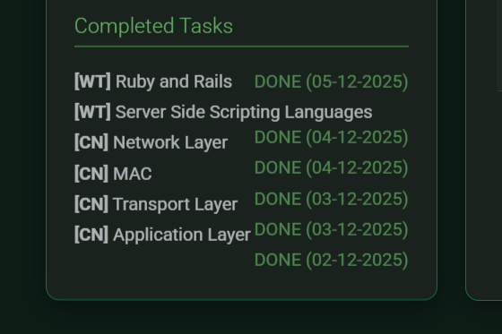

# TrackSpace

'TrackSpace: A Study Companion' is a simple web application that helps students organize their subjects, chapters, and study progress in one place. It is built to be clean, lightweight, and easy to understand.

## Features

- Add and manage subjects
- Organize chapters and topics
- Set deadlines and difficulty levels
- Track progress in a simple table view

## Screenshots

## How to Run the Project

Follow the steps below to run this project on your local system.

1. Clone the repository

  git clone https://github.com/nishtha911/smart_study_companion.git

2. Move into the project folder

  `cd smart_study_companion`

3. Set up a local server (XAMPP) (Install it from https://www.apachefriends.org/)

- Move the project folder into the `htdocs` directory
- Open the XAMPP Control Panel
- Start Apache and MySQL

4. Create and import the database

- Open `http://localhost/phpmyadmin`
- Create a new database named `study_companion_db`
- Import the provided `.sql` file into this database

5. Run the project in your browser

  http://localhost/smart_study_companion

## Contributing

Contributions are welcome and encouraged.

To contribute:
- Fork this repository
- Create a new branch for your changes
- Commit your updates
- Push your branch
- Open a pull request

If you find bugs or have feature suggestions, feel free to open an issue :)
